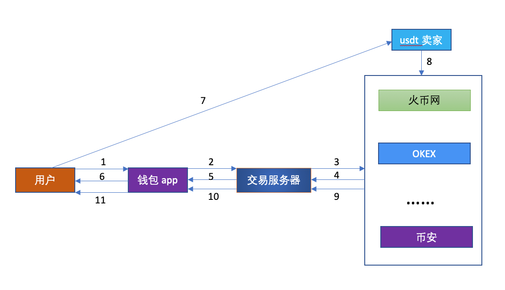
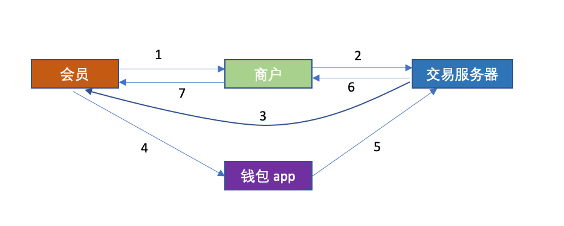

### usdt钱包设计

1. 概念

  - 钱包app
  - 交易服务器
  - 外部交易平台
  - OTC 场外交易
  - 商户api

2. 交易流程
   
  - 钱包充提交易
  
    * 这类交易只发生在 **钱包app** 和 **交易服务器** 之间
    * OTC 通过挂接外部交易平台(如火币网)实现. 掉单的情况下，需要客服联系**会员**及**OTC卖家**和**外部交易平台客服**追踪充值到账情况
    * 用户通过**钱包app**提供的**OTC场外交易**功能通过**法币**或者**加密货币**购买usdt.
    * 用户可以选择从钱包提走usdt

    -  具体交易过程如下:

          
      1. 用户打开**钱包app**
      2. 用户在**钱包app**选择购买usdt
      3. 交易服务器从外部交易平台获取usdt出售单
      4. 外部交易平台返回usdt出售单信息给**交易服务器**
      5. **交易服务器**返回usdt出售单信息给**钱包app**
      6. **钱包app**显示出售单信息给用户, 包含成交价格以及卖家的收款信息(银行卡，支付宝等)
      7. 用户使用根据卖家收款信息, 使用支付宝，银行卡等进行法币支付
      8. 卖家向**外部交易平台**确认收到法币
      9. **第三方交易平台**确认usdt到账至**交易服务器**在**外部交易平台**所开账户
      10. **交易服务器**确认usdt到账至用户**钱包app**
      11. 用户购买usdt成功到账至**钱包app**

  - 会员充值交易
    * 这类交易发生在**商户平台**,**钱包app** 和 **交易服务器**
    * 商户接入 api
    * 商户会员可以通过usdt进行充值
    * 全程usdt交易和结算，没有法币参与
  
    - 具体交易过程如下:

        
      1. 会员在商户平台充值选usdt充值通道
      2. 商户向交易服务器发起充值请求
      3. 交易服务器返回充值页面(二维码或者跳转按钮)
      4. 会员点击充值页面跳转按钮直接唤醒**钱包app** 或者 打开**钱包app**扫描充值页面二维码(支付操作过程类似支付宝)
      5. **钱包app**向交易服务器发起交易请求
      6. **交易服务器**判断交易成功，回调商户
      7. 商户给会员上分
